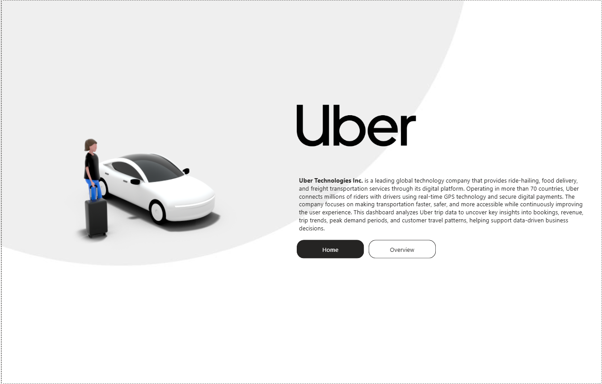
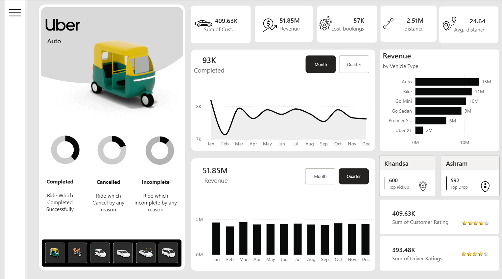

# 🚖 Uber Ride Analysis Dashboard — Power BI

An interactive Power BI dashboard analyzing 150,000 Uber ride bookings across Delhi (NCR) for the year 2025 — covering ride completions, cancellations, revenue, ratings, and vehicle-type performance.

## 📁 Overview

This project explores ride-booking data to uncover patterns in customer behavior, driver cancellations, revenue generation, and service quality across different vehicle types and locations.

## 🗂️ Data Source

- **File:** `data/uber.xlsx`
- **Records:** 150,000 bookings
- **Time period:** Jan 2025 – Dec 2025
- **Columns include:** Date, Time, Booking ID, Booking Status, Customer ID, Vehicle Type, Pickup/Drop Location, Cancellation Reasons, Booking Value, Ride Distance, Driver/Customer Ratings, Payment Method

> Note: This appears to be a simulated/sample dataset (Delhi locations, synthetic Booking IDs) rather than live Uber data — suitable for practice and portfolio purposes.

## 🛠️ Tools Used

- **Power BI Desktop** — data modeling, DAX measures, visuals
- **Power Query** — data cleaning and transformation
- **Excel** — source data format

## 📸 Dashboard Preview

**Home Page**


**Overview Page**


## 🔍 Key Insights

**From the dashboard:**
- **93K rides completed**, generating **₹51.85M in revenue** (quarterly view).
- **57K bookings were lost** — cancelled or unmatched — highlighting a meaningful gap between demand and fulfilled rides.
- Rides covered a combined **2.51M km**, averaging **24.64 km per trip**.
- **Revenue by vehicle type:** Auto leads at **₹13M**, followed by Bike (₹11M), Go Mini (₹10M), Go Sedan (₹9M), Premier Sedan (₹6M), and Uber XL (₹2M) — Auto and Bike together drive the largest share of revenue.
- **Top pickup location:** Khandsa (600 rides); **top drop location:** Ashram (592 rides) — useful for identifying high-demand zones.
- **Customer and driver satisfaction is strong**, with cumulative rating sums of 409.63K (customer) and 393.48K (driver), both trending toward the 4-star mark.

**From deeper analysis of the raw data:**
- **Driver-side cancellations are the biggest source of ride loss:** ~27,000 rides (18% of all bookings) were cancelled by drivers, compared to ~10,500 (7%) cancelled by customers.
- **"No Driver Found"** accounted for another ~10,500 bookings (7%), suggesting supply-demand gaps in certain areas or time slots.
- **UPI is the dominant payment method** (45,909 transactions, ~31%), followed by Cash (25,367) — reflecting strong digital payment adoption.
- **Top customer cancellation reasons:** "Wrong Address," "Change of plans," and "Driver is not moving towards pickup location" are nearly tied as leading causes.
- **Top driver cancellation reasons:** "Customer related issue," "customer coughing/sick," and "personal/car-related issues" dominate, each cited over 6,700 times.
- **Incomplete rides** (~9,000 total) were mainly due to **Customer Demand** and **Vehicle Breakdown**, each contributing roughly a third of cases.

## 📊 How to Use

1. Clone this repository:
```bash
   git clone https://github.com/yourusername/uber-powerbi-project.git
```
2. Open `report/Uber_app_analysis.pbix` in **Power BI Desktop**.
3. If prompted, update the data source path to point to `data/uber.xlsx`, then click **Refresh**.

## 📂 File Structure
